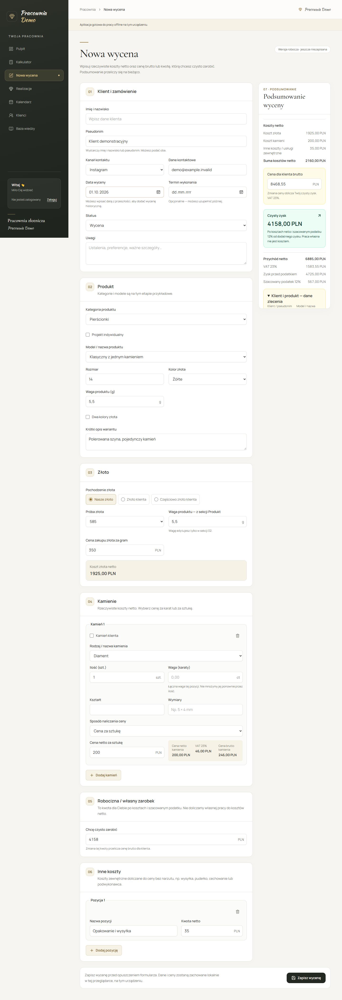

# Jewelry Workshop Management

A local-first application for preparing quotations and managing custom jewelry orders in a small workshop.

The project addresses a real workflow: inquiries arrive through social media, the shop and direct contact; product specifications, material calculations and production notes are recorded in several places. The application brings these records into one workspace and translates workshop pricing and gold-settlement rules into repeatable calculations.

**Created and developed by Maksymilian Bacia**, from workshop process analysis and business rules to application implementation, testing and documentation. The interface is in Polish; portfolio documentation is in English.

This repository is a standalone portfolio snapshot. The interface uses the neutral demonstration brand **Pracownia Demo**; screenshots contain fictional inputs. No business identity, customer records or production credentials are included.



## Business problem

Preparing a quotation requires more than multiplying a weight by a price. Customer-provided gold may have several finenesses, stones can be priced per piece or carat, and the final price must reconcile material costs, VAT and the workshop's expected earnings. Handwritten notes make these decisions harder to reproduce and hand over to production.

The product has three priorities:

- Keep the quotation and product specification together.
- Preserve agreed prices when reference prices change.
- Support everyday work locally, with cloud synchronization between workshop devices.

See the [business process](docs/business-process.md) and [business rules](docs/business-rules.md).

## Implemented capabilities

| Capability | Current behavior |
| --- | --- |
| Quotations | Customer name or nickname, contact channel, product, materials, date, status and notes |
| Pricing | Net material and external costs, gross price, VAT, quotation profit and margin, and estimated earnings after tax; calculate from either desired earnings or an agreed gross price |
| Customer gold | Multiple finenesses, fine-gold conversion, workshop loss allowance and shortfall |
| Stones | Per-piece or per-carat costs, shape, dimensions and customer-owned stones |
| Orders | Saved quotation snapshots, full editing, completion and restoration |
| Photographs | Local preparation, gallery, private cloud storage and deletion synchronization |
| Knowledge base | Stones and products, search, flat groups, editing and archive |
| Quick calculator | Local saved calculations and transfer to a quotation draft |
| Synchronization | Workspace binding, persistent pending changes and explicit conflict resolution |
| PWA | Installation and prepared offline interface on desktop and mobile |
| Diagnostics | Bounded logs and a report that excludes quotation contents and credentials |

Calendar and a separate customer directory currently contain placeholder screens. Deposits and printable production cards are part of the target process, not implemented features. No measured savings in time or costs are claimed.

## Cost and pricing model

Each quotation connects net material and external costs with the customer's gross price and the workshop's estimated earnings. The calculation separates net revenue, VAT, quotation profit, profit margin as a percentage of net revenue, and an estimated tax deduction.

The demonstration pricing assumptions are 23% VAT and an estimated tax deduction of 12% of positive quotation profit. Owner labor is treated as earnings; operating overhead is not automatically included. These figures support quotation decisions within this model, rather than representing full business profitability or tax accounting.

- **Two pricing directions:** derive the gross price from desired earnings after the estimated deduction, or calculate profit and margin from an agreed gross price.
- **Historical quotation snapshots:** retain saved inputs and calculated totals when reference prices change. Metadata-only edits preserve pricing; a full form save deliberately replaces the snapshot.
- **Data validation:** check numeric formats, precision, ranges, quantities and gold fineness before returning totals. Invalid calculation inputs block saving, and revision checks prevent overwriting a newer record.
- **Calculation tests:** cover cost, net/gross and VAT reconciliation, estimated tax, profit and margin, rounding, loss-making quotations, customer-owned materials and gold-settlement boundaries.

The project demonstrates how a real operational process can be translated into an explicit cost model, documented business rules and testable data checks.

See the [financial assumptions and business rules](docs/business-rules.md), [calculation implementation](src/features/quotes/calculations.ts) and [regression tests](src/features/quotes/calculations.test.mjs).

## Architecture

Next.js App Router · React · TypeScript · Tailwind CSS · Dexie/IndexedDB · Supabase Auth/PostgreSQL/Storage.

Local transactions are the first persistence step. Cloud synchronization uses workspace membership, row-level security and revision checks. Saved quotations contain their own input and result snapshots; opening one does not recalculate it from today's prices.

[Architecture](docs/architecture.md) · [Data model](docs/data-model.md) · [Security boundaries](docs/security.md)

## Run locally

Requires Node.js 22.18 or newer and npm.

```bash
npm ci
npm run dev -- --hostname 127.0.0.1
```

Open http://127.0.0.1:3000. Local development works without a cloud account. Keep the same address, port and browser profile to access the same IndexedDB database.

Production builds require valid Supabase configuration. Start with [.env.example](.env.example) and follow [getting started](docs/getting-started.md). Cloud setup must use a separate development project.

## Demonstration

[Demo walkthrough](docs/demo.md) contains fictional inputs and expected calculations. The application starts with an empty local database and does not load production records or create a cloud workspace.

| Screenshot | View |
| --- | --- |
| [Quotation](docs/screenshots/quotation.png) | Form and pricing summary |
| [Order](docs/screenshots/order.png) | Saved customer and product specification |
| [Knowledge base](docs/screenshots/knowledge.png) | Reference catalog |
| [Mobile calculator](docs/screenshots/calculator-mobile.png) | Quick pricing on a small screen |

## Verification

```bash
npm test
npm run lint
npm run build
npm run test:e2e
```

Tests cover financial arithmetic, local persistence and migrations, SQL/RLS, synchronization retries and conflicts, photographs and offline behavior. Cloud tests use isolated fixtures rather than a live workshop database. See [testing](docs/testing.md) for configuration and the release validation record.

## Roadmap

- Printable production card and customer summary.
- Deposit tracking and a clearer acceptance-to-production handoff.
- Backup/export and a recovery workflow.
- Calendar and dedicated customer records.
- Measure quotation preparation time and handoff completeness in workshop use.

## Rights

Copyright remains with the author; no open-source license is granted. See [LICENSE](LICENSE).
