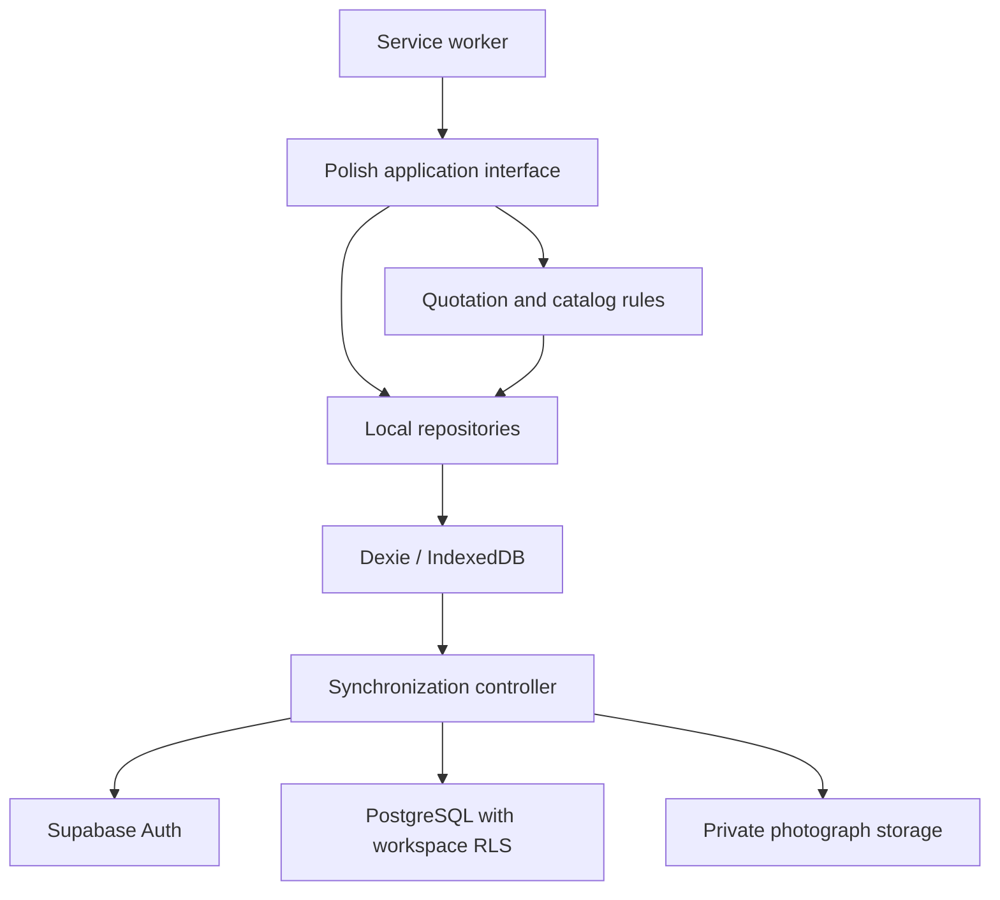

# Architecture

## Persistence and synchronization

The browser commits business data to IndexedDB through Dexie before requesting cloud synchronization. Local operations do not require login. A cloud account must explicitly bind the local database to a workspace before synchronization.

The service worker supplies the prepared offline interface. It does not persist business records, authentication tokens or cloud responses in its cache.

## Boundaries

| Area | Responsibility |
| --- | --- |
| src/app | Routes, layout and metadata |
| src/features/quotes | Form, exact pricing, snapshots and order views |
| src/features/quotes/data | IndexedDB schema, transactions and revision checks |
| src/features/calculator | Local reusable calculations and quotation draft transfer |
| src/features/knowledge | Reference catalog, flat presentation and synchronization |
| src/features/sync | Quotes, photographs, pending requests and conflicts |
| src/features/pwa | Offline interface and installation status |
| src/features/diagnostics | Allowlisted diagnostic metadata and bounded local logs |
| src/lib/supabase | Configuration, transport, authentication and mapping |
| supabase/migrations | Schema, constraints and workspace access policies |

## Concurrency

Local revision checks prevent an old form or browser tab from overwriting newer local data. Cloud updates compare the baseline revision and server timestamp. Requests in progress are persisted so a lost response can be reconciled after restart. Conflicts require an explicit choice.

Quote synchronization runs before photograph synchronization so parent records exist. Knowledge categories precede their dependent records. The controller schedules work on local saves, restored sessions and network recovery, and polls while signed in and online. A manual synchronization action is also available. Synchronization does not continue in a closed application.

## Data compatibility

The current Dexie database version is 9. Earlier migration definitions remain because existing installations may contain older records. Calculator records remain local and are not part of cloud synchronization. Monetary snapshots are not silently recomputed during a schema upgrade.

## Decisions and tradeoffs

| Decision | Benefit | Constraint |
| --- | --- | --- |
| Local-first storage | Local persistence during network loss | Data belongs to a browser origin and profile |
| Snapshot quotations | Reproducible accepted price | Snapshot editing replaces the prior version |
| Exact financial arithmetic | Consistent rounding | Decimal parsing and scale handling must be explicit |
| Explicit conflict resolution | User controls competing changes | Conflicts require user attention |
| Private Storage and RLS | Access follows workspace membership | Cloud setup must configure membership correctly |
| Polish interface | Fits workshop users | English UI is not implemented |

Offline support requires a completed production PWA preparation. Unsaved form edits are not durable. Cloud synchronization is not a versioned backup or disaster-recovery system.
