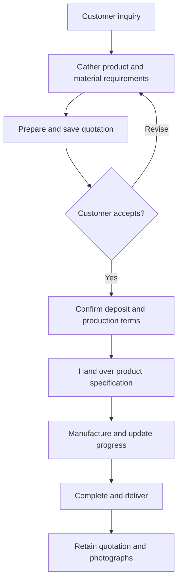

# Business process

## Context and roles

The application was designed around a small custom-jewelry workshop. Customer-facing work includes collecting requirements and preparing a quotation; production work needs a clear specification of the accepted order.

| Role | Responsibility |
| --- | --- |
| Customer | Describe the product, approve conditions and provide materials when applicable |
| Workshop contact | Gather requirements, prepare the quotation and communicate acceptance |
| Maker | Check materials and specification, manufacture and finish the product |
| Workspace owner | Manage access to synchronized workshop data |

These business roles do not imply separate application permissions. Cloud roles are owner and member.

## AS-IS: manual workflow

Inquiries arrive through Instagram, Facebook, the shop or direct contact. The workshop clarifies dimensions, design, gold and stones; calculates a price; agrees conditions and usually a deposit; then passes a paper or phone note to production. Progress and earlier quotations are spread across conversations and notes.

| Observation | Consequence | Product response |
| --- | --- | --- |
| Details stored in different places | Repeated questions and incomplete handoff | One saved quotation and specification |
| Material calculations repeated manually | Less reproducible pricing | Shared, tested calculation functions |
| Customer gold has different finenesses | Physical weights cannot be added as equivalent alloy | Fine-gold conversion and a target fineness |
| Earlier prices may be overwritten | Harder to explain an accepted quotation | Snapshot of inputs and results |
| Work moves between devices | Device-specific records diverge | Local-first storage and conflict-aware sync |

## TO-BE: target workflow

The map below describes the target business workflow; it is a process map, not a BPMN 2.0 diagram.

The application implements quotation preparation, specifications, order status, completion, photographs and saved history. Acceptance is represented by a status. Deposit accounting, a printable production handoff and delivery confirmation are future work; the diagram does not assert they exist.

## Requirements and acceptance evidence

| Requirement | Acceptance behavior | Evidence in repository |
| --- | --- | --- |
| Quote from real material costs | Changing gross price changes estimated earnings | calculations.test.mjs, calculator.spec.ts |
| Preserve historical agreement | Opening or changing notes does not reprice a quotation | local-database.spec.ts, quote-sync.spec.ts |
| Continue locally | A committed record remains after restart | local-persistence.spec.ts |
| Avoid silent overwrite | Concurrent revision requires user resolution | quote-sync.spec.ts, sync-e2e.spec.ts |
| Show reference knowledge first | Catalog opens with search and departments; management is separate | knowledge-e2e.spec.ts |
| Preserve committed data offline | Prepared PWA can reopen local views | pwa-e2e.spec.ts |

## Success criteria for workshop evaluation

Measure median quotation preparation time, how often product requirements need to be clarified during production, the share of orders with complete specifications and unresolved synchronization conflicts. These are proposed evaluation metrics; a baseline and measured results have not been established.
