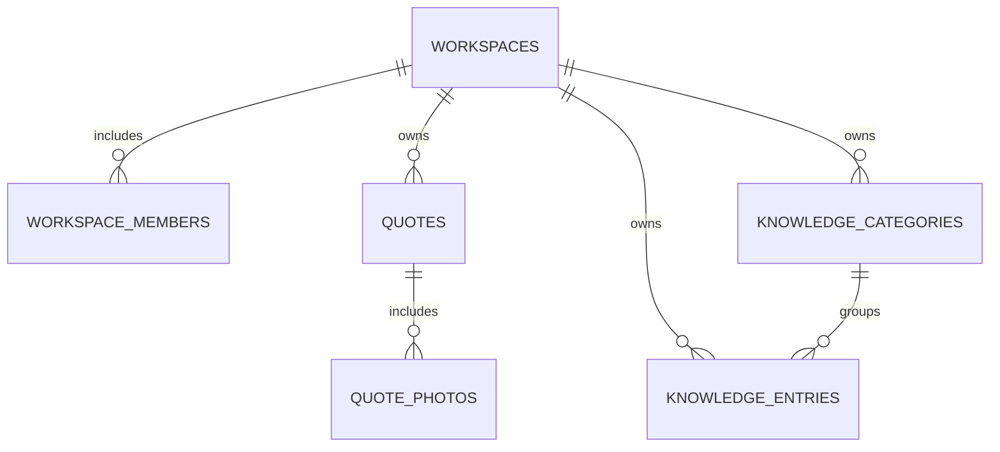

# Data model

## Local database

Dexie database name: jewelry-workshop-demo. Current schema version: 9. The portfolio uses its own empty database namespace; it does not load an operational installation’s records.

| Table | Purpose | Cloud synchronization |
| --- | --- | --- |
| quotes | Inputs, calculated totals, metadata, revision and completion | Yes |
| quotePhotos | Local photo blobs and metadata | Yes |
| quoteSync | Quote baselines, requests in progress and conflicts | Local journal |
| photoSync | Photograph transfer and deletion journal | Local journal |
| syncSettings | Project/workspace binding and synchronization times | Local settings |
| appLogs | Bounded diagnostic events | No |
| knowledgeCategories | Reference catalog grouping | Yes |
| knowledgeEntries | Stone and product reference records | Yes |
| knowledgeSync | Catalog baselines, pending deletions and conflicts | Local journal |
| calculations | Saved quick-calculator drafts | No |
| calculationTransfers | Calculator snapshot for a new quotation | No |

## Cloud database

Members reference Supabase Auth users. Quotes and catalog entries contain JSONB business payloads alongside indexed identity, revision and lifecycle fields. Knowledge entries have generated category foreign keys. Photograph blobs live in a private Storage bucket; their metadata lives in quote_photos.

Migrations retain tombstones needed by other devices. User-visible departments and flat groups are a projection of the stored catalog identifiers; reading the catalog does not restructure existing records.

## Identity and history

Local UUIDs remain stable in the cloud. Local and cloud revisions serve different concurrency checks. A quotation snapshot is not an append-only audit log: full editing replaces it. Completion and restoration retain the same identity.

Code definitions: src/features/quotes/data/database.ts, src/features/quotes/data/types.ts, src/features/quotes/types.ts, src/features/knowledge/types.ts and supabase/migrations/.
